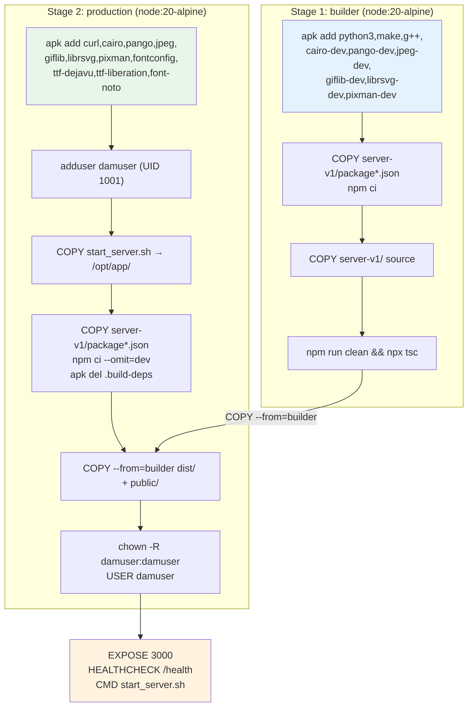
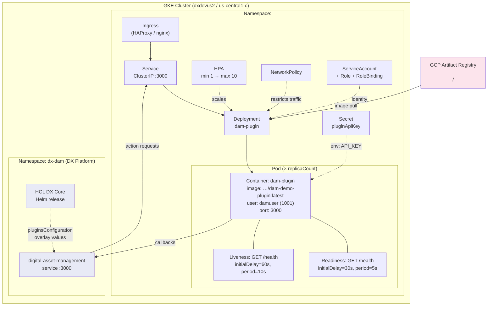
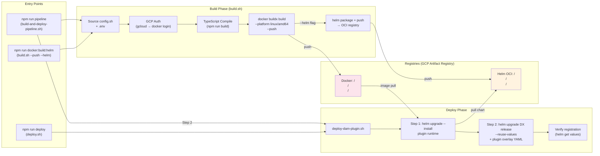

# DAM Plugin — Production Delivery Architecture

> **Document scope**: Build toolchain, container packaging, Helm-based Kubernetes deployment, versioning strategy, CI/CD pipeline design, and security posture for the HCL DX DAM Plugin monorepo.
>
> **Repository root**: `DAM-Demo - Avnet/`  
> **Last updated**: June 2025

---

## Table of Contents

1. [Build & Packaging Flow (Detailed)](#1-build--packaging-flow-detailed)
2. [Deployment Architecture (K8s + Helm)](#2-deployment-architecture-k8s--helm)
3. [Versioning Strategy](#3-versioning-strategy)
4. [CI/CD Pipeline Design](#4-cicd-pipeline-design)
5. [Security & Enterprise Readiness](#5-security--enterprise-readiness)
6. [Customer-Facing Architecture Summary](#6-customer-facing-architecture-summary)

---

## 1. Build & Packaging Flow (Detailed)

### 1.1 Build Entry Points

All build operations funnel through four shell scripts and their npm aliases:

| npm script | Underlying command | What it does |
|---|---|---|
| `npm run docker:build` | `./scripts/build.sh` | Local Docker build only |
| `npm run docker:build:push` | `./scripts/build.sh --push` | Build + push image to GCP Artifact Registry |
| `npm run docker:build:helm` | `./scripts/build.sh --push --helm` | Build + push image **and** package + push Helm chart |
| `npm run pipeline` | `./scripts/build-and-deploy-pipeline.sh` | Full pipeline: build → push → deploy → register |

### 1.2 Build Script Internals (`scripts/build.sh` — 246 lines)

The build script (`scripts/build.sh`) is the core artifact producer. It sources `scripts/config.sh` which loads the `.env` file and sets defaults:

```
.env → config.sh → build.sh
```

**Config defaults** (from `scripts/config.sh`):

| Variable | Default Value |
|---|---|
| `DOCKER_REGISTRY` | `<DockerRegistry>` |
| `IMAGE_NAME` | `dam-demo-plugin` |
| `IMAGE_TAG` | `latest` |
| `HELM_REGISTRY` | `<HelmRegistry>` |
| `NAMESPACE` | `default` |
| `RELEASE_NAME` | `dam-plugin` |
| `PLATFORM` | `linux/amd64` |

**Build phases executed in order:**

| Phase | Action | Key detail |
|---|---|---|
| 1 — Clean | `rm -rf ./build && mkdir -p ./build` | Wipes previous artifacts |
| 2 — GCP Auth | `gcloud auth print-access-token \| docker login -u oauth2accesstoken --password-stdin https://us-central1-docker.pkg.dev` | Only when `--push` or `--helm` flag set |
| 3 — TypeScript | `cd packages/server-v1 && npm run build` | Compiles LoopBack 4 server to `dist/` |
| 4 — Docker buildx | `docker buildx build --platform linux/amd64 -f packages/Dockerfile ./packages` | Dual-tags: `$IMAGE_TAG` + `latest`. Uses named builder `dam-plugin-builder`. `--load` for local, `--push` for registry. |
| 5 — Helm (optional) | `helm package ./helm/dam-plugin -d ./build && helm push ./build/dam-plugin-*.tgz oci://$HELM_REGISTRY` | Only with `--helm` flag |

**Produced artifacts:**

| Artifact | Location | Format |
|---|---|---|
| Docker image (local) | Docker daemon cache | `$DOCKER_REGISTRY/$IMAGE_NAME:$IMAGE_TAG` |
| Docker image (remote) | `<ImageRepository>` | OCI image |
| Helm chart (local) | `./build/dam-plugin-1.0.0.tgz` | `.tgz` |
| Helm chart (remote) | `<HelmChartRepository>` | OCI artifact |

### 1.3 Docker Multi-Stage Build (`packages/Dockerfile` — 103 lines)



**Key Dockerfile decisions:**

| Decision | Detail |
|---|---|
| Base image | `node:20-alpine` (both stages) — minimal attack surface |
| Native modules | `canvas`, `sharp` require Cairo/Pango/JPEG build toolchain — installed then purged via `.build-deps` virtual package |
| Fonts | DejaVu, Liberation, Noto CJK installed for watermark text rendering |
| Non-root user | `damuser` UID/GID 1001 — enforced via `USER damuser` directive |
| Health check | `node -e "require('http').get('http://localhost:3000/health'...)"` — 30s interval, 3s timeout, 40s start-period, 3 retries |
| Entrypoint | `/opt/app/start_server.sh` — loads ConfigMap and Secret volume mounts as env vars before `exec node dist/index.js` |

### 1.4 Container Entrypoint (`packages/start_server.sh` — 54 lines)

The startup script performs runtime configuration injection:

1. **ConfigMap mount** → iterates `/etc/config/*`, converts filenames to `UPPER_SNAKE_CASE`, exports as env vars
2. **Secret mount** → iterates `/etc/secrets/*`, same filename-to-envvar pattern
3. **Defaults** → `PORT=3000`, `HOST=0.0.0.0`, `NODE_ENV=production`, `LOG_LEVEL=info`
4. **Exec** → `cd /opt/app/server-v1 && exec node dist/index.js`

This pattern decouples configuration from the image — the same image binary runs in dev, staging, and production with different ConfigMap/Secret volumes.

---

## 2. Deployment Architecture (K8s + Helm)

### 2.1 Helm Chart Structure

```
helm/dam-plugin/
├── Chart.yaml              # v1.0.0, appVersion 1.0.0
├── values.yaml             # Default values (dev/baseline)
├── values-prod.yaml        # Production overrides
├── values-<Namespace>.yaml   # Environment-specific (<Namespace>)
├── values2.yaml            # Alternative (nginx + cert-manager TLS)
└── templates/
    ├── _helpers.tpl         # Template helpers (fullname, labels, selectorLabels)
    ├── deployment.yaml      # Deployment with probes, env injection, security context
    ├── service.yaml         # ClusterIP service on port 3000
    ├── hpa.yaml             # HorizontalPodAutoscaler (autoscaling/v2)
    ├── ingress.yaml         # Optional ingress (HAProxy or nginx)
    ├── networkpolicy.yaml   # Restrictive ingress/egress rules
    ├── secret.yaml          # Auto-generated pluginApiKey
    ├── serviceaccount.yaml  # Dedicated service account
    ├── role.yaml            # RBAC Role
    ├── rolebinding.yaml     # RBAC RoleBinding
    └── NOTES.txt            # Post-install instructions (93 lines)
```

### 2.2 Deployment Topology



### 2.3 Values File Breakdown — Environment Matrix

| Feature | `values.yaml` (dev) | `values-prod.yaml` | `values-<Namespace>.yaml` | `values2.yaml` |
|---|---|---|---|---|
| **replicas** | 1 | 3 | (inherits) | (inherits) |
| **HPA min/max** | 1–10 | 3–20 | (inherits) | (inherits) |
| **CPU target** | 80% | 70% | (inherits) | (inherits) |
| **Memory target** | 80% | 75% | (inherits) | (inherits) |
| **CPU request/limit** | 100m / 500m | 250m / 1000m | (inherits) | (inherits) |
| **Memory request/limit** | 256Mi / 512Mi | 512Mi / 1Gi | (inherits) | (inherits) |
| **Ingress** | disabled | disabled | HAProxy, `<DXHostname>` | nginx + cert-manager TLS |
| **Network Policy** | enabled (dx-dam ns) | enabled (dx-dam ns) | (inherits) | (inherits) |
| **Service Discovery** | disabled | enabled | (inherits) | (inherits) |
| **DB host** | `<PostgresServiceName>` | (unset) | env-specific | (unset) |

### 2.4 Image Injection at Deploy Time

The deploy scripts use `--set` overrides to inject the image reference at deploy time, ensuring the Helm chart is registry-agnostic:

```bash
helm upgrade --install "$RELEASE_NAME" "$HELM_CHART_PATH" \
    --namespace "$NAMESPACE" \
    --set image.repository="${DOCKER_REGISTRY}/${IMAGE_NAME}" \
    --set image.tag="$IMAGE_TAG" \
    --set plugin.authKey="${AUTH_KEY}"
```

The `deployment.yaml` template consumes this:
```yaml
image: "{{ .Values.image.repository }}:{{ .Values.image.tag | default .Chart.AppVersion }}"
imagePullPolicy: {{ .Values.image.pullPolicy }}  # Always (default)
```

For `:latest` tags, `deploy.sh` forces a rollout restart to guarantee the new image is pulled:
```bash
kubectl rollout restart deployment/$RELEASE_NAME -n "$NAMESPACE"
kubectl rollout status deployment/$RELEASE_NAME -n "$NAMESPACE" --timeout=5m
```

### 2.5 Two-Step Deployment Model (`deploy-dam-plugin.sh` — 522 lines)

The primary deployment script performs two distinct Helm operations:

**Step 1 — Deploy Plugin Runtime**
```bash
helm upgrade --install "${PLUGIN_RELEASE}" "${PLUGIN_CHART_REF}" \
    -n "${NAMESPACE}" \
    -f "${PLUGIN_VALUES}" \
    --set image.repository="${IMAGE_REGISTRY}/${IMAGE_NAME}" \
    --set image.tag="${TAG}" \
    --set plugin.authKey="${AUTH_KEY}" \
    --wait --timeout 5m
```

**Step 2 — Register Plugin with DX DAM**

Auto-detects the existing DX Helm release chart reference, generates a temporary overlay YAML, and upgrades the DX release:

```yaml
# Generated at /tmp/dam-plugin-registration-${NAMESPACE}.yaml
hcl-dx-deployment:
  configuration:
    digitalAssetManagement:
      extensibility:
        pluginsConfiguration:
          dam-demo-plugin:
            enabled: true
            url: "http://dam-demo-plugin-dam-plugin.${NS}.svc.cluster.local:3000/dx/api/dam-demo-plugin/v1/plugin"
            callBackHost: "http://${NS}-digital-asset-management:3000"
            authKey: "${AUTH_KEY}"
            actions:
              watermark:
                url: "/api/v1/actions/watermark"
              metadata:
                url: "/api/v1/actions/metadata"
              process:
                url: "/api/v1/process"
```

```bash
helm upgrade "${DX_RELEASE}" "${DX_CHART_REF}" \
    -n "${NAMESPACE}" \
    --reuse-values \
    -f "${DX_PLUGIN_REG_FILE}" \
    --wait --timeout 10m
```

This approach is **non-destructive**: `--reuse-values` preserves all existing DX configuration and only overlays the plugin registration block.

### 2.6 Kubernetes Resource Summary

| Resource | Template | Key Configuration |
|---|---|---|
| **Deployment** | `templates/deployment.yaml` | `runAsNonRoot: true`, `runAsUser: 1001`, `allowPrivilegeEscalation: false`, `capabilities.drop: ALL` |
| **Service** | `templates/service.yaml` | `ClusterIP:3000` (internal only by default) |
| **HPA** | `templates/hpa.yaml` | `autoscaling/v2`, CPU + Memory targets |
| **Ingress** | `templates/ingress.yaml` | Optional, supports HAProxy and nginx class |
| **NetworkPolicy** | `templates/networkpolicy.yaml` | Ingress: only from `dx-dam` namespace + same pod label. Egress: DNS (UDP 53) + DAM (TCP 3000) + External APIs (TCP 443) |
| **Secret** | `templates/secret.yaml` | `pluginApiKey` auto-generated via `randAlphaNum 32` if not provided, `externalApiKey` optional |
| **ServiceAccount** | `templates/serviceaccount.yaml` | Dedicated account with RBAC Role + RoleBinding |

---

## 3. Versioning Strategy

### 3.1 Current Version Locations

| Artifact | File | Current Value | Field |
|---|---|---|---|
| npm monorepo | `package.json` | `1.0.0` | `version` |
| Helm chart | `helm/dam-plugin/Chart.yaml` | `1.0.0` | `version` |
| Helm appVersion | `helm/dam-plugin/Chart.yaml` | `1.0.0` | `appVersion` |
| Docker tag (default) | `scripts/config.sh` | `latest` | `IMAGE_TAG` |

### 3.2 Docker Tag Strategy

The build script always produces **two tags** per build:

```bash
docker buildx build \
    --tag ${DOCKER_REGISTRY}/${IMAGE_NAME}:${IMAGE_TAG} \
    --tag ${DOCKER_REGISTRY}/${IMAGE_NAME}:latest \
    ...
```

| Scenario | `$IMAGE_TAG` | Tags pushed |
|---|---|---|
| Default build | `latest` | `latest` (deduplicated) |
| Version build (`-t v1.2.3`) | `v1.2.3` | `v1.2.3` + `latest` |
| CI build (future) | `$GIT_SHA` or `$BUILD_NUMBER` | SHA/number + `latest` |

**Risk**: The `:latest` tag is mutable. In production, this means a `helm upgrade` with `--reuse-values` will still reference `latest`, and pods may pull different images across restarts. The `deploy.sh` script mitigates this with a forced `kubectl rollout restart` after every deploy.

### 3.3 Helm Chart Versioning

The Helm chart uses a single version (`1.0.0`) in `Chart.yaml`. The `helm package` command reads `version` from Chart.yaml to produce `dam-plugin-1.0.0.tgz`. Pushing to OCI stores it at:

```
<HelmChartRepository>:1.0.0
```

There is currently **no automated version bump mechanism** — the version must be manually updated in `Chart.yaml` before building a new chart release.

### 3.4 Recommendations for Production

| Area | Current State | Recommendation |
|---|---|---|
| Docker tags | Dual-tag with mutable `latest` | Use immutable tags (git SHA or semver) in production; reserve `latest` for dev |
| Helm chart version | Manual bump in `Chart.yaml` | Automate via `helm-docs` or a release script that reads git tags |
| Monorepo version | Static `1.0.0` in root `package.json` | Consider `lerna version` for coordinated bumps |
| Image digest pinning | Not implemented | Pin by `sha256` digest in production values files |
| Git tagging | No tagging strategy observed | Tag releases (`v1.0.0`) and derive Docker/Helm versions from git tags |

---

## 4. CI/CD Pipeline Design

### 4.1 Current State: Script-Driven Pipeline

**There is no hosted CI/CD configuration in this repository.** No GitHub Actions workflows, Jenkinsfiles, GitLab CI configs, or Azure Pipelines definitions were found. The pipeline is entirely implemented as composable shell scripts.

### 4.2 Pipeline Orchestration



### 4.3 Script Dependency Graph

```
build-and-deploy-pipeline.sh
├── build.sh (--push --helm)
│   └── config.sh
│       └── .env
└── deploy-dam-plugin.sh (-n $NAMESPACE)
    ├── helm upgrade --install (plugin chart)
    └── helm upgrade (DX release + overlay)
```

### 4.4 Pipeline Execution Modes

| Mode | Command | Build | Push | Helm Chart | Deploy | Register |
|---|---|---|---|---|---|---|
| **Full pipeline** | `./scripts/build-and-deploy-pipeline.sh -n $NS` | ✅ | ✅ | ✅ | ✅ | ✅ |
| **Build only (local)** | `./scripts/build.sh` | ✅ | ❌ | ❌ | ❌ | ❌ |
| **Build + push** | `./scripts/build.sh --push` | ✅ | ✅ | ❌ | ❌ | ❌ |
| **Build + push + helm** | `./scripts/build.sh --push --helm` | ✅ | ✅ | ✅ | ❌ | ❌ |
| **Deploy only (local chart)** | `./scripts/deploy.sh` | ✅ | ❌ | ❌ | ✅ | ❌ |
| **Deploy only (remote)** | `./scripts/deploy.sh --remote` | ❌ | ❌ | ❌ | ✅ | ❌ |
| **Deploy + register** | `./scripts/deploy-dam-plugin.sh -n $NS` | ❌ | ❌ | ❌ | ✅ | ✅ |
| **Skip build, deploy only** | `./scripts/build-and-deploy-pipeline.sh -n $NS --skip-build --local-chart` | ❌ | ❌ | ❌ | ✅ | ✅ |

### 4.5 CI/CD Integration Blueprint

While no CI config exists today, the scripts are designed for easy integration. Recommended GitHub Actions workflow:

```yaml
# .github/workflows/build-deploy.yml (PROPOSED — not yet in repo)
name: DAM Plugin CI/CD
on:
  push:
    branches: [main]
    tags: ['v*']
  pull_request:
    branches: [main]

jobs:
  build:
    runs-on: ubuntu-latest
    permissions:
      contents: read
      id-token: write  # For Workload Identity Federation
    steps:
      - uses: actions/checkout@v4
      - uses: actions/setup-node@v4
        with: { node-version: '20' }
      - uses: google-github-actions/auth@v2
        with:
          workload_identity_provider: ${{ secrets.WIF_PROVIDER }}
          service_account: ${{ secrets.GCP_SA }}
      - uses: google-github-actions/setup-gcloud@v2
      - run: npm run docker:build:helm  # build.sh --push --helm

  deploy-dev:
    needs: build
    if: github.ref == 'refs/heads/main'
    runs-on: ubuntu-latest
    steps:
      - uses: actions/checkout@v4
      - uses: google-github-actions/get-gke-credentials@v2
        with:
          cluster_name: dxdevus2
          location: us-central1-c
      - run: ./scripts/deploy-dam-plugin.sh -n dev --remote

  deploy-prod:
    needs: build
    if: startsWith(github.ref, 'refs/tags/v')
    runs-on: ubuntu-latest
    environment: production  # Requires approval
    steps:
      - uses: actions/checkout@v4
      - uses: google-github-actions/get-gke-credentials@v2
        with:
          cluster_name: dxdevus2
          location: us-central1-c
      - run: ./scripts/deploy-dam-plugin.sh -n production --remote -t ${{ github.ref_name }}
```

---

## 5. Security & Enterprise Readiness

### 5.1 Authentication & Registry Access

| Boundary | Mechanism | Detail |
|---|---|---|
| **GCP → Docker Registry** | OAuth2 token via `gcloud auth print-access-token` | Short-lived token (~1hr); no stored credentials. `docker login -u oauth2accesstoken --password-stdin https://us-central1-docker.pkg.dev` |
| **GCP → Helm OCI Registry** | Same OAuth2 pattern | `helm registry login -u oauth2accesstoken --password-stdin https://us-central1-docker.pkg.dev` |
| **DX DAM → Plugin** | API key (shared secret) | `pluginApiKey` — auto-generated 32-char `randAlphaNum` if not provided, stored as K8s Secret, injected as `API_KEY` env var |
| **Plugin → DX DAM** | `callBackHost` + `authKey` | Registered during DX release overlay; `authKey` passed in both plugin env and DX `pluginsConfiguration` block |

### 5.2 Container Security

| Control | Implementation | File |
|---|---|---|
| Non-root execution | `USER damuser` (UID 1001, GID 1001) | `packages/Dockerfile` |
| `runAsNonRoot` enforcement | `podSecurityContext.runAsNonRoot: true` | `helm/dam-plugin/values.yaml` |
| Privilege escalation blocked | `securityContext.allowPrivilegeEscalation: false` | `helm/dam-plugin/values.yaml` |
| Capabilities dropped | `capabilities.drop: [ALL]` | `helm/dam-plugin/values.yaml` |
| Minimal base image | `node:20-alpine` — reduced CVE surface | `packages/Dockerfile` |
| Build deps purged | `.build-deps` virtual package installed then `apk del` in same layer | `packages/Dockerfile` |
| Health check | Built-in `HEALTHCHECK` + K8s liveness/readiness probes | `packages/Dockerfile`, `templates/deployment.yaml` |

### 5.3 Network Security (NetworkPolicy)

The `networkpolicy.yaml` template enforces a **default-deny + allowlist** model:

**Ingress rules (who can reach the plugin):**
- Pods from `dx-dam` namespace on TCP 3000
- Pods with label `app: dx-dam` from allowed namespaces
- Same-namespace pods matching selector labels (for inter-replica traffic)

**Egress rules (what the plugin can reach):**
- DNS resolution: `kube-system` namespace, UDP 53
- DAM callbacks: allowed namespaces, TCP 3000
- External APIs (e.g., Google Vision): any namespace, TCP 443

### 5.4 Secrets Management

| Secret | Source | Storage | Injection Path |
|---|---|---|---|
| `pluginApiKey` | Auto-generated `randAlphaNum 32` or explicit `--set` | K8s Secret → `secretKeyRef` | Container env `API_KEY` |
| `externalApiKey` | Explicit `--set` or values file | K8s Secret → `secretKeyRef` | Container env `EXTERNAL_API_KEY` |
| `damAdminToken` | Explicit provision | K8s Secret (via values) | Available for auto-registration |
| DB password | Environment-specific secret or Helm value | Deployment env var | Container env `DB_PASSWORD` |
| GCP auth token | `gcloud auth print-access-token` | Short-lived, in-memory only | Never persisted |

**⚠ Production concern**: Database credentials should be externalized to Kubernetes Secrets or your secret manager and injected at deploy time.

### 5.5 RBAC

The chart creates a dedicated `ServiceAccount`, `Role`, and `RoleBinding` per release. The service account is namespace-scoped and grants only the permissions needed by the plugin workload. No cluster-wide permissions are requested.

### 5.6 Enterprise Readiness Checklist

| Area | Status | Notes |
|---|---|---|
| Non-root container | ✅ | UID 1001, enforced at pod and container level |
| Capability dropping | ✅ | `ALL` capabilities dropped |
| Network isolation | ✅ | NetworkPolicy with namespace-scoped allowlist |
| Auto-generated secrets | ✅ | 32-char random API key |
| Health probes | ✅ | Liveness (60s initial) + Readiness (30s initial) |
| HPA autoscaling | ✅ | CPU + Memory targets, configurable per environment |
| Image pull policy | ✅ | `Always` — ensures registry image is used |
| TLS support | ⚠️ | Available via `values2.yaml` (cert-manager) but not default |
| Image digest pinning | ❌ | Not implemented — relies on mutable tags |
| External secret management | ❌ | DB password hardcoded in values file |
| CI/CD pipeline | ❌ | Script-driven only, no hosted CI/CD |
| Vulnerability scanning | ❌ | No container scanning step in build pipeline |

---

## 6. Customer-Facing Architecture Summary

### What Gets Built

A **LoopBack 4 (TypeScript/Node 20) server** packaged as a multi-stage Alpine Docker image. The image is approximately 200–300MB and contains:
- The compiled application (`dist/`)
- Production-only npm dependencies (native Sharp and Canvas modules)
- Required system fonts (DejaVu, Liberation, Noto) for watermark rendering
- A lightweight startup script that loads configuration from Kubernetes volumes

### Where It Lives

All artifacts are stored in **Google Cloud Platform Artifact Registry** in the `us-central1` region:

| Artifact | Registry URL |
|---|---|
| Docker images | `<ImageRepository>` |
| Helm charts | `<HelmChartRepository>` |

### How It Deploys

A **two-step Helm deployment** orchestrated by shell scripts:

1. **Plugin deployment** — `helm upgrade --install` deploys the plugin as its own Helm release (Deployment, Service, HPA, NetworkPolicy, Secret, ServiceAccount, RBAC)
2. **DX registration** — A second `helm upgrade` on the existing HCL DX release injects plugin configuration into the DAM extensibility block (non-destructive, uses `--reuse-values`)

The plugin exposes three DAM actions:
- `watermark` → `/api/v1/actions/watermark`
- `metadata` → `/api/v1/actions/metadata`
- `process` → `/api/v1/process`

### How It Scales

| Environment | Replicas | HPA Range | CPU Limit | Memory Limit |
|---|---|---|---|---|
| Development | 1 | 1–10 | 500m | 512Mi |
| Production | 3 | 3–20 | 1000m | 1Gi |

Scaling is automatic via HPA based on CPU utilization (70–80%) and memory utilization (75–80%).

### How It's Secured

- **Container**: Non-root user (UID 1001), all Linux capabilities dropped, no privilege escalation
- **Network**: Kubernetes NetworkPolicy restricts traffic to DAM namespace only, egress limited to DNS + DAM callbacks + HTTPS
- **Auth**: Auto-generated 32-character API key shared between plugin and DX DAM
- **Registry**: GCP IAM-controlled access via short-lived OAuth2 tokens — no stored credentials

### What's Needed for Production CI/CD

The repository currently uses **local script execution** (no GitHub Actions, Jenkins, etc.). The scripts are composable and CI-ready — a single `./scripts/build-and-deploy-pipeline.sh -n $NAMESPACE` command runs the full pipeline. Integration with any CI system requires:

1. GCP authentication (Workload Identity Federation recommended)
2. GKE cluster credentials (`gcloud container clusters get-credentials`)
3. Execution of the existing shell scripts — no new tooling needed

---

*Generated from source analysis of the DAM-Demo - Avnet repository. All file paths, registry URLs, and configuration values are extracted from actual source files.*
